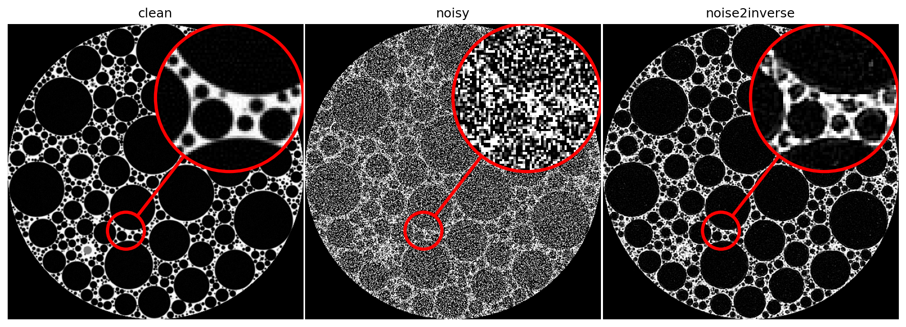

A fork of Noise2Inverse, updated to run on UW’s Hyak.

## What was added/changed

1. New environment-hyak.yml file: Python 3.10, PyTorch GPU build from conda-forge, tomosipo installed from Github (its no longer on PyPI), bm3d from pip.
2. Edit to tomo.py file: changed the old torch.rfft/torch.irfft for the newer torch.fft functions.
3. Edit to tiffs.py file: changed tifffile.imsave to imwrite as the old name was removed.
4. Edit to fig.py file: fixed a matplotlib call that the newer versions reject
5. Edit to 03_train.py and 04_evaluate.py: changed the network from MSD to UNet, as the msd_pytorch package is no longer installable.
6. New .py scripts: converted jupyter notebooks with nbconvert to scripts so they run headless on a compute node. 
7. New run_hyak.sh file: a batch script that runs the whole pipeline on the node's local disk and saves the results back to gscratch. 
8. Training now runs more epochs (epochs = 200 in 03_train.py) for stronger denoising.
9. 05_metrics.py now reports the noisy baseline next to the denoised metrics.
10. 04_evaluate.py and 05_metrics.py now save the figure and metrics to disk  (figure_evaluate.png, figure_metrics.png, metrics.txt), and run_hyak.sh packages them into the compressed archive. 
11. Reduced training batch size 8 to 2 and set PYTORCH_CUDA_ALLOC_CONF=expandable_segments to fit Hyak's GPU memory.

## How to run the updated Noise2Inverse on Hyak

1. Login to UW’s HPC Hyak: run ssh netid@klone.hyak.uw.edu and follow the prompts to login with your password and DUO authentication. 
2. Create a folder named with your netid: run cd /gscratch then cd stf (or your lab’s allocation/account, here is student technology fee, stf) then mkdir <netid> then cd netid
3. Check if you have conda installed: run conda --version and if it prints a version skip to step 6. If it says command not found, install your own with the next steps. 
4. Download the Miniforge installer into your gscratch: run  wget "https://github.com/conda-forge/miniforge/releases/latest/download/Miniforge3-Linux-x86_64.sh" -O miniforge.sh
5. Install miniforge: run bash miniforge.sh -b -p /gscratch/stf/<netid>/miniforge3
6. Make this shell aware of the miniforge install and verify: run source /gscratch/stf/<netid>/miniforge3/etc/profile.d/conda.sh then run conda --version
7. Clone the noise2inverse updated repo: git clone https://github.com/amill111/noise2inverse.git
8. Build the hyak compatible environment: run cd noise2inverse, then run conda env create -f environment-hyak.yml
9. Running the pipeline with the sbatch script: run sbatch run_hyak.sh and use squeue -u your uw net id to check the status of the job 
10. tail -50 n2i_<newjobid>.out to see if it worked

Note: the install location in step 5 must match the CONDA path in run_hyak.sh. If you install miniforge in a different location you must edit the run_hyak.sh file.

## Results 

| Metric        | Noisy (baseline) | Denoised |
|---------------|:----------------:|:--------:|
| PSNR (volume) |       3.80       |  16.93   |
| SSIM (volume) |       0.28       |   0.62   |
| PSNR (slice)  |       3.83       |  16.84   |
| SSIM (slice)  |       0.26       |   0.57   |

## Credit/liscence

Forked from [Noise2Inverse](https://github.com/ahendriksen/noise2inverse) by Allard Hendriksen et al. If you use this work, please cite:

  A. A. Hendriksen, D. M. Pelt, and K. J. Batenburg, "Noise2Inverse:
  Self-Supervised Deep Convolutional Denoising for Tomography," *IEEE
  Transactions on Computational Imaging*, vol. 6, pp. 1320–1335, 2020,
  doi: 10.1109/TCI.2020.3019647. 

@article{Hendriksen_2020,
   title={Noise2Inverse: Self-Supervised Deep Convolutional Denoising for Tomography},
   volume={6},
   ISSN={2573-0436},
   url={http://dx.doi.org/10.1109/TCI.2020.3019647},
   DOI={10.1109/tci.2020.3019647},
   journal={IEEE Transactions on Computational Imaging},
   publisher={Institute of Electrical and Electronics Engineers (IEEE)},
   author={Hendriksen, Allard Adriaan and Pelt, Daniel Maria and Batenburg, K. Joost},
   year={2020},
   pages={1320–1335} }

Licensed under GPL v3 (see LICENSE.md). This fork remains GPL v3; changes from the original are documented in "What was added/changed" above.

